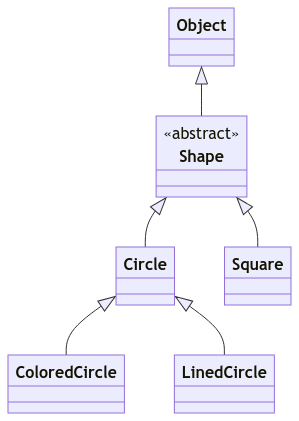
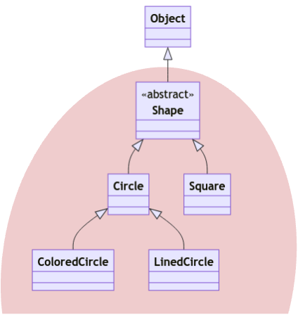
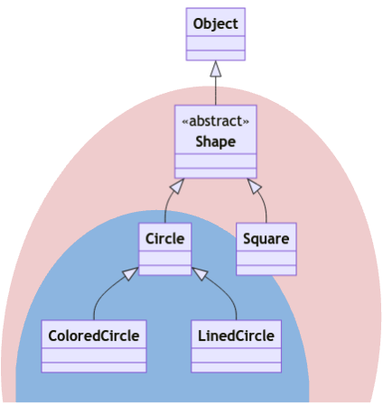
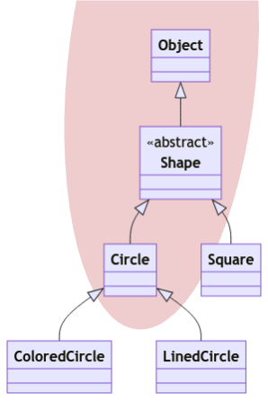
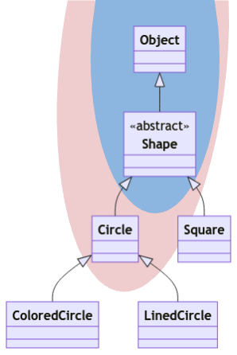
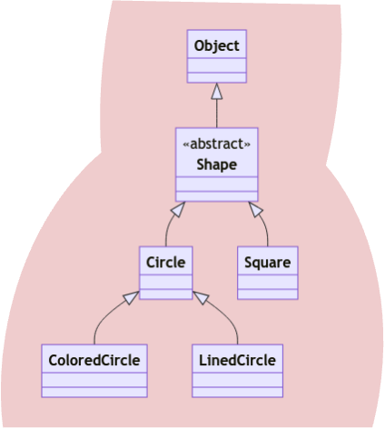

# Unit 26: Wildcards

!!! abstract "Learning Objectives"

    Students should

    - be aware of the meaning of wildcard `?` and bounded wildcards.
    - know how to use wildcards to write methods that are more flexible in accepting a range of types.
    - know that upper-bounded wildcard is covariant and lower-bounded wildcard is contravariant.
    - know the PECS principle and how to apply it.
    - be aware that the unbounded wildcard allows us to not use raw types in our programs.

## Running Example

For our running example in this unit, we will be using the following subtyping relationship.

```java
abstract class Shape {
    :
}

class Circle extends Shape {
    :
}

class Square extends Shape {
    :
}

class ColoredCircle extends Circle {
    :
}

class LinedCircle extends Circle {
    :
}
```

The class diagram for visualization is shown below.  Note that `Shape` extends from `Object` implicitly.



## `contains` with `Array<T>`

Now that we have our `Array<T>` class, let's modify our generic `contains` method and replace the type of the argument `T[]` with `Array<T>`.

```Java
class A {
  // version 0.5 (with generic array)
  public static <T> boolean contains(Array<T> array, T obj) {
    for (int i = 0; i < array.getLength(); i++) {
      T curr = array.get(i);
      if (curr.equals(obj)) {
        return true;
      }
    }
    return false;
  }
}
```

Similar to the version that takes in `T[]`, using generics allows us to constrain the type of the elements of the array and the object to search for to be the same.  This allows the following code to type-check correctly:

```Java
Array<String> stringArray;
Array<Circle> circleArray;
Circle circle;
  :
A.<String>contains(stringArray, "hello"); // ok
A.<Circle>contains(circleArray, circle); // ok
```

But trying to search for a circle in an array of strings would lead to a type error:

```Java
A.<String>contains(stringArray, circle); // error
```

Consider now having an array of shapes.

```Java
Array<Shape> shapeArray;
Array<Circle> circleArray;
Shape shape;
Circle circle;
  :
A.<Shape>contains(shapeArray, shape); // ok
A.<Circle>contains(circleArray, circle); // ok
```

As expected, we can pass `Shape` as the argument for `T`, and search for a `Shape` in an instance of `Array<Shape>`. Similarly, we can pass `Circle` as the argument for `T` and search for a `Circle` in an instance of `Array<Circle>`.

We could also look for a `Circle` instance from `Array<Shape>` if we pass `Shape` as the argument for `T`.

```Java
A.<Shape>contains(shapeArray, circle); // ok
```

Note that we can pass in a `Circle` instance as a `Shape`, since `Circle` <: `Shape`.

Recall that generics are invariant in Java (_i.e., there is no subtyping relationship between_ `Array<Shape>` _and_ `Array<Circle>`).  `Array<Circle>` is not a subtype of `Array<Shape>`.  Otherwise, it would violate the Liskov Substitution Principle, we can put a square into an `Array<Shape>` instance, but we can't put a square into an `Array<Circle>` instance.

So, we can't call:
```Java
A.<Circle>contains(shapeArray, circle); // compilation error
```

The following would result in compilation errors as well:

```Java
A.<Shape>contains(circleArray, shape); // compilation error
A.<Circle>contains(circleArray, shape); // compilation error
```

Thus, with our current implementation, we can't look for a shape (_which may be a circle_) in an array of circles, even though this is something reasonable that a programmer might want to do.  This constraint is due to the invariance of generics -- while we avoided the possibility of run-time errors by avoiding covariance arrays, our methods have become less general.

Let's see how we can fix this with bounded type parameters first.  We can introduce another type parameter, say `S`, to remove the constraints that the type of the array must be the same as the type of the object to search for.  I.e., we change from

```Java
  public static <T> boolean contains(Array<T> array, T obj) { .. }
```

to:
```Java
  public static <S,T> boolean contains(Array<T> array, S obj) { .. }
```

But we don't want to completely decouple `T` and `S`, as we want `T` to be a subtype of `S`.  We can thus make `T` a bounded type parameter, and write:
```Java
  public static <S, T extends S> boolean contains(Array<T> array, S obj) { .. }
```

Now, we can search for a shape in an array of circles.
```Java
     A.<Shape,Circle>contains(circleArray, shape);
```

## Copying to and from `Array<T>`

Let's consider another example.  Let's add two methods `copyFrom` and `copyTo`, to `Array<T>` so that we can copy to and from one array to another.

```Java
// version 0.4 (with copy)
class Array<T> {
  private T[] array;

  Array(int size) {
    // The only way we can put an object into the array is through
    // the method set() and we only put an object of type T inside.
    // So it is safe to cast `Object[]` to `T[]`.
    @SuppressWarnings("unchecked")
    T[] a = (T[]) new Object[size];
    this.array = a;
  }

  public void set(int index, T item) {
    this.array[index] = item;
  }

  public T get(int index) {
    return this.array[index];
  }

  public void copyFrom(Array<T> src) {
    int len = Math.min(this.array.length, src.array.length);
    for (int i = 0; i < len; i++) {
      this.set(i, src.get(i));
    }
  }

  public void copyTo(Array<T> dest) {
    int len = Math.min(this.array.length, dest.array.length);
    for (int i = 0; i < len; i++) {
      dest.set(i, this.get(i));
    }
  }
}
```

With this implementation, we can copy, say, an `Array<Circle>` to another `Array<Circle>`, an `Array<Shape>` to another `Array<Shape>`, but not an `Array<Circle>` into an `Array<Shape>`, even though each circle is a shape!

```Java
Array<Circle> circleArray;
Array<Shape> shapeArray;
  :
shapeArray.copyFrom(circleArray); // error
circleArray.copyTo(shapeArray); // error
```

## Upper-Bounded Wildcards

Let's consider the method `copyFrom`.  We should be able to copy from an array of shapes, an array of circles, an array of squares, etc, into an array of shapes.  In other words, we should be able to copy from _an array of any subtype of shapes_ into an array of shapes.  Is there such a type in Java?

The type that we are looking for is `Array<? extends Shape>`.  This generic type uses the _wildcard_ `?`.  Just like a wild card in card games, it is a substitute for any type.   A wildcard can be bounded.  Here, this wildcard is upper-bounded by `Shape` (_i.e., the_ `?` _can be substituted with either_ `Shape` _or any subtype of_ `Shape`).

They key here is _substituted_.  Consider our running example.  Given the type `Array<? extends Shape>`, the `?` can be substituted with any one of the following:

- `Shape`: because `Shape` <: `Shape` so we get `Array<Shape>`.
- `Circle`: because `Circle` <: `Shape` so we get `Array<Circle>`.
- `Square`: because `Square` <: `Shape` so we get `Array<Square>`.
- `ColoredCircle`: because `ColoredCircle` <: `Shape` so we get `Array<ColoredCircle>`.
- `LinedCircle`: because `LinedCircle` <: `Shape` so we get `Array<LinedCircle>`.

This can be seen more clearly by looking at the class diagram.  In the class diagram below, the types that can be used to substitute `?` is highlighted with red background.



What this means is that we can actually do the following sequence of assignments.

```java
Array<? extends Shape> arr;
arr = new Array<ColoredCircle>(1);
arr = new Array<Square>(1);
```

The upper-bounded wildcard is an example of covariance. The upper-bounded wildcard has the following subtyping relations:

- If `S` <: `T`, then `A<? extends S>` <: `A<? extends T>` (_covariance_)
- For any type `S`, `A<S>` <: `A<? extends S>`

To see this, consider `Array<? extends Circle>` and `Array<? extends Shape>`.  Now we look at the types that can be used to substitute `?` in both cases.  The types are summarized in the table below.

| `Array<? extends Circle>` | `Array<? extends Shape>` |
|---------------------------|--------------------------|
| - | `Shape` |
| `Circle` | `Circle` |
| - | `Square` |
| `ColoredCircle` | `ColoredCircle` |
| `LinedCircle` | `LinedCircle` |

So, whatever type can be used to substitute `?` in `Array<? extends Circle>` can also be used to substitute `?` in `Array<? extends Shape>`.  So the following assignment would work because whatever type we substitute `?` with, `Array<? extends Shape>` can accept those.

```java
Array<? extends Circle> arr1 = ..; // run-time type omitted
Array<? extends Shape> arr2 = arr1;
```

The table can also be visualized using class diagram.  Blue background highlights the type that can be used to substitute `?` for `Array<? extends Circle>` and red background highlights the type that can be used to substitute `?` for `Array<? extends Shape>`.  If one is a subset of the other, it implies a subtyping relationship.



Simply using the covariance rule above, we can also infer a few things.  For instance, we can infer `Array<Circle>` <: `Array<? extends Shape>`.  The proof is as follows

1. `Circle` <: `Shape` <span style="float:right">(_given_)</span>
2. `Array<Circle>` <: `Array<? extends Circle>` <span style="float:right">(_upper-bounded wildcard property_)</span>
3. `Array<? extends Circle>` <: `Array<? extends Shape>` <span style="float:right">(_using (1) and covariance of upper-bounder wildcard_)</span>
4. `Array<ircle>` <: `Array<? extends Shape>` <span style="float:right">(_transitivity of subtyping relationship using (2) and (3)_)</span>

So now, because `Array<Circle>` <: `Array<? extends Shape>`, if we change the type of the parameter to `copyFrom` to `Array<? extends T>`, 

```Java
  public void copyFrom(Array<? extends T> src) {
    int len = Math.min(this.array.length, src.array.length);
    for (int i = 0; i < len; i++) {
      this.set(i, src.get(i));
    }
  }
```

We can now call:

```java
shapeArray.copyFrom(circleArray); // ok
```

without error.

## Lower-Bounded Wildcards

Let's now try to allow copying of an `Array<Circle>` to `Array<Shape>`.

```Java
circleArray.copyTo(shapeArray); 
```

by doing the same thing:

```Java
  public void copyTo(Array<? extends T> dest) {
    int len = Math.min(this.array.length, dest.array.length);
    for (int i = 0; i < len; i++) {
        dest.set(i, this.get(i));
    }
  }
```

The code above would not compile.  We will get the following somewhat cryptic message when we compile with the `-Xdiags:verbose` flag:

```
Array.java:32: error: method set in class Array<T> cannot be applied to given types;
        dest.set(i, this.get(i));
          ^
  required: int,CAP#1
  found: int,T
  reason: argument mismatch; T cannot be converted to CAP#1
  where T is a type-variable:
    T extends Object declared in class Array
  where CAP#1 is a fresh type-variable:
    CAP#1 extends T from capture of ? extends T
1 error
```

!!! note "CAP?"
    The type `CAP#1` is an internal compiler name for the implicit type parameter represented by the wildcard (_i.e.,_ `?`).  The name comes from "_capture_".  The numbering is to differentiate the different captured types.

    Similar to how different declared type parameters are renamed with `#1` and `#2`, all the `?` are referring to different implicit type parameters.  So, the different `?` can be replaced with different type arguments.

Let's try not to understand what the error message means first, and think about what could go wrong if the compiler allows:

```Java
        dest.set(i, this.get(i));
```

Here, we are trying to put an instance with compile-time type `T` into an array that contains elements with the compile-time type of `T` or subtype of `T`.  

The `copyTo` method of `Array<Shape>` would allow an `Array<Circle>` as an argument, and we would end up putting instance with compile-time type `Shape` into `Array<Circle>`.  If all the shapes are circles, we are fine, but there might be other shapes (_rectangles, squares_) in `this` instance of `Array<Shape>`, and we can't fit them into `Array<Circle>`!  Thus, the line 

```Java
        dest.set(i, this.get(i));
```

is not type-safe and could lead to `ClassCastException` during run-time.  

Where can we copy our shapes into?  We can only copy them safely into an `Array<Shape>`, `Array<Object>`, `Array<GetAreable>`, for instance.  In other words, into arrays containing `Shape` or supertype of `Shape`.  

We need a wildcard lower-bounded by `Shape`, and Java's syntax for this is `? super Shape`.  Using this new notation, we can replace the type for `dest` with:

```Java
  public void copyTo(Array<? super T> dest) {
    int len = Math.min(this.array.length, dest.array.length);
    for (int i = 0; i < len; i++) {
      dest.set(i, this.get(i));
    }
  }
```

The code would now type-check and compile.  We can do the entire reasoning similar to the reasoning we did for upper-bounder wildcard.  First, let's keep it specific.  We will let `T` to be `Circle`.  This means `Array<? super T>` should be treated as `Array<? super Circle>`[^1].  So now we try to figure out what are the types that can be used to substitute `?` in `Array<? super Circle>`.  There are only 3 possible types:

[^1]: The reasoning can be made more abstract without restricting `T` but that will only complicate things and make it more difficult to follow the argument.

- `Circle`: because `Circle` <: `Circle` so we get `Array<Circle>`.
- `Shape`: because `Circle` <: `Shape` so we get `Array<Shape>`.
- `Object`: because `Circle` <: `Object` so we get `Array<Object>`.

Again, visually, this will be the following class diagram.



Now, looking back at the relevant part of the code of `copyTo`, we see the following line:

```java
        dest.set(i, this.get(i));
```

First, the method `set` has the following signature: `Array::set(int, T)`.  The type `T` depends on the type of `dest`.  Second, the method `get` has the following descriptor `T Array::get(int)`.  The type`T` depends on the type of `this`.

Now, remember, the compile-time type of `dest` is `Array<? super Circle>` and the compile-time type of `this` is `Array<Circle>` (_because we let_ `T` _to be_ `Circle`).  By process of enumeration, we see that all possibilities of types that can be used to substitute `?` in the compile-time type of `dest` can safely accept `Circle`.

- `Circle`: the method signature for `set` is `Array::set(int, Circle)` and the return type of `Array::get(int)` is `Circle` so this type-checked because `Circle` <: `Circle`.
- `Shape`: the method signature for `set` is `Array::set(int, Shape)` and the return type of `Array::get(int)` is `Circle` so this type-checked because `Circle` <: `Shape`.
- `Object`: the method signature for `set` is `Array::set(int, Object)` and the return type of `Array::get(int)` is `Circle` so this type-checked because `Circle` <: `Object`.

The lower-bounded wildcard is an example of contravariance.  We have the following subtyping relations:

- If `S` <: `T`, then `A<? super T>` <: `A<? super S>` (_contravariance_)
- For any type `S`, `A<S>` <: `A<? super S>`

Without going into the lengthy explanation with the tables, we will show the class diagram showing that `Array<? super Shape>` is a subtype of `Array<? super Circle>`.



Since we did the proof for upper-bounded wildcard, let us do the same for lower-bounded wildcard.  We will show that `Array<Shape>` <: `Array<? super Circle>`.

1. `Circle` <: `Shape` <span style="float:right">(_given_)</span>
2. `Array<Shape>` <: `Array<? super Shape>` <span style="float:right">(_lower-bounded wildcard property_)</span>
3. `Array<? super Shape>` <: `Array<? super Circle>` <span style="float:right">(_using (1) and contravariance of lower-bounded wildcard_)</span>
4. `Array<Shape>` <: `Array<? super Circle>` <span style="float:right">(_transitivity of subtyping relationship using (2) and (3)_)</span>

The line of code below now compiles:

```Java
circleArray.copyTo(shapeArray); 
```

Our new `Array<T>` is now

```Java
// version 0.5 (with flexible copy using wildcards)
class Array<T> {
  private T[] array;

  Array(int size) {
  // The only way we can put an object into the array is through
  // the method set() and we only put an object of type T inside.
  // So it is safe to cast `Object[]` to `T[]`.
  @SuppressWarnings("unchecked")
    T[] a = (T[]) new Object[size];
  this.array = a;
  }

  public void set(int index, T item) {
    this.array[index] = item;
  }

  public T get(int index) {
    return this.array[index];
  }

  public void copyFrom(Array<? extends T> src) {
    int len = Math.min(this.array.length, src.array.length);
    for (int i = 0; i < len; i++) {
      this.set(i, src.get(i));
    }
  }

  public void copyTo(Array<? super T> dest) {
    int len = Math.min(this.array.length, dest.array.length);
    for (int i = 0; i < len; i++) {
      dest.set(i, this.get(i));
    }
  }
}
```

!!! danger "Non Subtype Reasoning"
    So far, we have shown the visualization for subtyping relationship.  In both cases, the types that can be substituted for `?` for the subtype is a subset of the types that can be substituted for `?` for the supertype.  What about the case where there is no subtyping relationship?

    Consider `Array<? extends Shape>` and `Array<? super Circle>`.  Neither are a subtype of the other.  So how would this look like in the class diagram?

    

    You can see that there is an overlap but clearly, none can be fully contained within the other.  This is what it looks like when there is no subtyping relationship.

## PECS

Now we will introduce the rule that governs when we should use the upper-bounded wildcard `? extends T` and a lower-bounded wildcard `? super T`.  It depends on the role of the variable.   If the variable is a producer that returns a variable of type `T`, it should be declared with the wildcard `? extends T`.  Otherwise, if it is a consumer that accepts a variable of type `T`, it should be declared with the wildcard `? super T`.

As an example, the variable `src` in `copyFrom` above acts as a _producer_.  It produces a variable of type `T`.  The type parameter for `src` must be either `T` or a subtype of `T` to ensure type safety.  So the type for `src` is `Array<? extends T>`.    

On the other hand, the variable `dest` in `copyTo` above acts as a _consumer_.  It consumes a variable of type `T`.  The type parameter of `dest` must be either `T` or supertype of `T` for it to be type-safe.  As such, the type for `dest` is `Array<? super T>`.  

This rule can be remembered with the mnemonic PECS, or "Producer Extends; Consumer Super".

### Deriving PECS

While it is easier to simply memorize PECS, you can actually derive these rules yourself.  The key here is to change your _point of view_ from the client to the implementer.  As a client, you have to think about how you can use the methods implemented by the implementer given the method descriptor.  Let's simulate that.

First, a convention.  Since we are looking through the lens of a method, the method _consumes_ a value via its parameter.  Additionally, the method _produces_ a value via its return value.

Assume that we have the following six variables.  We have to exclude `Shape` because it cannot be instantiated.  Note that `ColoredCircle` <: `Circle` <: `Object`.

```java
Object arg1 = new Object();
Circle arg2 = new Circle(..);
ColoredCircle arg3 = new ColoredCircle(..);

Object res1;
Circle res2;
ColoredCircle res3;
```

Now consider an implementer has implemented the method `f` with the following descriptor: `Circle f(Circle)`.  We can then see which of the method invocation works.

| Invocation | Argument Type | Compilation |
|------------|---------------|-------------|
| `f(arg1)` | `Object` | :material-close: |
| `f(arg2)` | `Circle` | :material-check: |
| `f(arg3)` | `ColoredCircle` | :material-check: |

`f(arg1)` fails compilation because the parameter is accepting `Circle` but we are passing `Object`.  Since `Object` is not a subtype of `Circle`, we have compilation error.

Now we assume that the argument will always be accepted by the parameter and we look at whether the return type can be accepted by the variable.

| Invocation | Variable Type | Compilation |
|------------|---------------|-------------|
| `res1 = f(..)` | `Object` | :material-check: |
| `res2 = f(..)` | `Circle` | :material-check: |
| `res3 = f(..)` | `ColoredCircle` | :material-close: |

`res3 = f(..)` fails compilation because the return type is `Circle`.  But we are trying to assign it to `ColoredCircle`.  Since `Circle` is not a subtype of `ColoredCircle`, we have compilation error.

Notice how what we have arrived at is the _opposite_ of PECS[^2].  Looking at the _consumer_ (_i.e., parameter_), we actually have "consumer extends" because we can accept `Circle` or subtype of `Circle` (_e.g.,_ `ColoredCircle`).  Looking at the _produced_ (_i.e., return value_), we actually have "producer super" because we can accept `Circle` or supertype of `Circle` (_e.g.,_ `Object`).

[^2]: CEPS? PSCE?

So how do we derive PECS then?  We need to look at it from the point of view of the implementer.  Consider that as an implementer, you will always do the following line.

```java
res2 = f(arg2);
```

So now, we need to know which of the following method descriptor can be used for `f`.  Let's draw two tables, one created by varying the parameter type and the other created by varying the return type.  Here we have to assume that each method descriptor are compiled separately and there is no overriding and/or overloading.

| Method Descriptor | Parameter Type | Compilation |
|-------------------|----------------|-------------|
| `Circle f(Object)` | `Object` | :material-check: |
| `Circle f(Circle)` | `Circle` | :material-check: |
| `Circle f(ColoredCircle)` | `ColoredCircle` | :material-close: |

Notice that now we are always passing `Circle` as argument.  So obviously, if a method can accept `Object`, it can also accept `Circle`.

| Method Descriptor | Return Type | Compilation |
|-------------------|----------------|-------------|
| `Object f(Circle)` | `Object` | :material-close: |
| `Circle f(Circle)` | `Circle` | :material-check: |
| `ColoredCircle f(Circle)` | `ColoredCircle` | :material-check: |

Similarly, notice that we are always going to assign the return value to a variable that can accept `Circle`.  So if the method always returns `ColoredCircle`, it can be assigned to `Circle`.

The result now conforms to PECS!  So to derive PECS, you can change your point of view from client to implementer.  This follows the explanation we have given for `copyTo` and `copyFrom`.  We are -- after all -- the implementer of these two functions.  In the case of `copyTo`, we are always going to invoke the line

```java
        dest.set(i, this.get(i));
```

This is similar to how we always execute `res2 = f(arg2);`.  Our choice of the type we can use for `res2` and `arg2` are now restricted.  In our derivation here, we change the method descriptor.  But in the explanation in this unit, we restrict the type parameter `T` to behave the way we want it to by using either upper-bounded or lower-bounded wildcards.

## Unbounded Wildcards

It is also possible to have unbounded wildcards, such as `Array<?>`.  `Array<?>` is the supertype of every parameterized type of `Array<T>`.  Recall that `Object` is the supertype of all reference types.  When we want to write a method that takes in a reference type, but we want the method to be flexible enough, we can make the method accept a parameter of type `Object`.  Similarly, `Array<?>` is useful when you want to write a method that takes in an array of some specific type, and you want the method to be flexible enough to take in an array of any type.  For instance, if we have:
 
```Java
void foo(Array<?> array) {
}
```

We could call it with:
```Java
Array<Circle> ac;
Array<String> as;
foo(ac); // ok
foo(as); // ok
```

A method that takes in generic type with unbounded wildcard would be pretty restrictive, however.  Consider this:

```Java
void foo(Array<?> array) {
    :
  x = array.get(0);
  array.set(0, y);
}
```

What should the type of the returned element `x` be?  Since `Array<?>` is the supertype of all possible `Array<T>`, the method `foo` can receive an instance of `Array<Circle>`, `Array<String>`, etc. as an argument.  The only safe choice for the type of `x` is `Object`.

The type for `y` is every more restrictive.  Since there are many possibilities of what type of array it is receiving, we can only put `null` into `array`! 

There is an important distinction to be made between `Array`, `Array<?>` and `Array<Object>`.  Whilst `Object` is the supertype of all `T`, it does not follow that `Array<Object>` is the supertype of all `Array<T>` due to generics being invariant. Therefore, the following statements will fail to compile:

```Java
Array<Object> a1 = new Array<String>(0); 
Array<Object> a2 = new Array<Integer>(0);
```

Whereas the following statements will compile:

```Java
Array<?> a1 = new Array<String>(0); // Does compile
Array<?> a2 = new Array<Integer>(0); // Does compile
```

If we have a function
```Java
void bar(Array<Object> array) {
}
```

Then, the method `bar` is restricted to _only_ takes in an `Array<Object>` instance as argument.

```Java
Array<Circle> ac;
Array<String> as;
bar(ac); // compilation error
bar(as); // compilation error
```

What about raw types?  Suppose we write the method below that accepts a raw type

```Java
void qux(Array array) {
}
```

Then, the method `qux` is also flexible enough to take in any `Array<T>` as argument.

```Java
Array<Circle> ac;
Array<String> as;
qux(ac); 
qux(as); 
```

Unlike `Array<?>`, however, the compiler does not have the information about the type of the component of the array, and cannot type check for us.  It is up to the programmer to ensure type safety.  For this reason, we must not use raw types.

Intuitively, we can think of `Array<?>`, `Array<Object>`, and `Array` as follows:

- `Array<?>` is an array of objects of some specific, but unknown type;
- `Array<Object>` is an array of `Object` instances, with type checking by the compiler;
- `Array` is an array of `Object` instances, without type checking.

!!! note "Unbounded and Non Wildcard"
    For completeness, we will show the visualization in class diagram for `Array<?>` and for non wildcard such as `Array<Circle>`.  In the case of unbounded, it actually encompasses all types!

    

    Clearly, it cannot be a subtype of anything besides `Array<?>` and `Object`.  The latter because `Object` is the root of the class hierarchy.  But at that point, we cannot invoke the methods intended for `Array`.

    Now for non wildcard, it is actually encompasses just that single type.  This is why `Array<Circle>` is a subtype of both `Array<? extends Circle>` and `Array<? super Circle>` when we reason only using class diagram visualization.

    

## Back to `contains`

Now, let's simplify our `contains` methods with the help of wildcards.  Recall that to add flexibility into the method parameter and allow us to search for a shape in an array of circles, we have modified our method into the following:

```Java
class A {
  // version 0.6 (with generic array)
  public static <S,T extends S> boolean contains(Array<T> array, S obj) {
    for (int i = 0; i < array.getLength(); i++) {
      T curr = array.get(i);
      if (curr.equals(obj)) {
        return true;
      }
    }
    return false;
  }
}
```

Can we make this simpler using wildcards?  Since we want to search for an object of type `S` in an array of its subtype, we can remove the second parameter type `T` and change the type of array to `Array<? extends S>`:

```Java
class A {
  // version 0.7 (with wild cards array)
  public static <S> boolean contains(Array<? extends S> array, S obj) {
    for (int i = 0; i < array.getLength(); i++) {
      S curr = array.get(i);
      if (curr.equals(obj)) {
        return true;
      }
    }
    return false;
  }
}
```

We can double-check that `array` is a producer (it produces `curr` on Line 5) and this follows the PECS rules.
Now, we can search for a shape in an array of circles.

```Java
     A.<Shape>contains(circleArray, shape);
```

## Revisiting Raw Types

In previous units, we said that you may use raw types only in two scenarios. Namely, when using generics and `instanceof` together, and when creating arrays. However, with unbounded wildcards, we can now see it is possible to remove both of these exceptions. We can now use `instanceof` in the following way:

```Java
a instanceof A<?> 
```

Recall that in the example above, `instanceof` checks of the run-time type of `a`.  Previously, we said that we can't check for, say,

```Java
a instanceof A<String> 
```

since the type argument `String` is not available during run-time due to erasure.  Using `<?>` fits the purpose here because it explicitly communicates to the reader of the code that we are checking that `a` is an instance of `A` with some unknown (_erased_) type parameter.

Similarly, we can create arrays in the following way:

```Java
new Comparable<?>[10];
```

Previously, we said that we could not create an array using the expression `new Comparable<String>[10]` because generics and arrays do not mix well.  Java insists that the array creation expression uses a _reifiable_ type, i.e., a type where no type information is lost during compilation.  Unlike `Comparable<String>`, however, `Comparible<?>` is reifiable.  Since we don't know what is the type of `?`, no type information is lost during erasure!

Going forward now in the module, we will not permit the use of raw types in any scenario.
